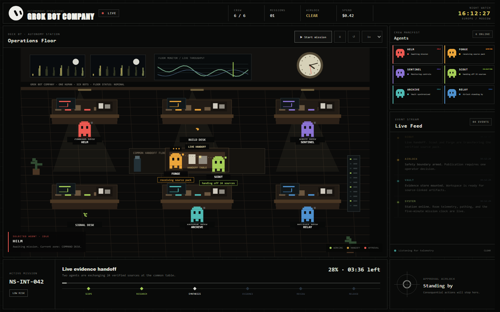

# Grok Bot Company

**Autonomous multi-agent operations interface for research, production, evidence control, review, and human-approved delivery.**



Grok Bot Company turns a team of specialist AI agents into a visible operating system. Instead of hiding agent work behind a chat window, it presents the entire workflow as a live operations floor: bots move between workstations, exchange artifacts, report progress, emit telemetry, and stop at an approval boundary before consequential actions.

The included mission, **NS-INT-042**, demonstrates a complete competitor-intelligence workflow. At normal speed it runs for approximately five minutes and processes 24 sources, creates a structured evidence pack, performs an independent audit, and prepares a controlled release.

> Grok Bot Company is an independent interface concept and is not an official xAI product.

## What the interface provides

- A continuous pixel-art operations room with six visible specialist bots.
- Live agent movement through collision-aware office routes.
- Real-time task labels such as `reading pricing pages`, `sourced 6 links`, and `cross-checking 24 citations`.
- Animated wall telemetry, workstation displays, city lights, and a real-time analog clock.
- A mission timeline with progress, ETA, cost, artifacts, and operational stages.
- A realistic event feed containing source discovery, handoffs, warnings, audit results, and system events.
- Human approval controls for external or high-impact actions.
- Responsive full-screen layout for desktop, laptop, tablet, and mobile widths.
- No framework, package installation, build process, or API key required.

## Agent team

| Agent | Responsibility | Typical output |
| --- | --- | --- |
| **Helm** | Chief of Staff | Mission scope, delegation graph, decision packet |
| **Scout** | Research Specialist | Verified sources, claims, confidence labels |
| **Forge** | Product and Synthesis | Claim map, analysis, finished brief |
| **Archive** | Memory and Artifacts | Evidence index, hashes, source lineage |
| **Sentinel** | QA and Safety Auditor | Independent checks, warnings, final verdict |
| **Relay** | External Operations | Release packet and approval request |

## Mission lifecycle

```text
Scope → Research → Synthesis → Evidence → Review → Release
```

1. **Helm** receives the objective and creates the work graph.
2. **Scout** collects and verifies 24 first-party sources.
3. Scout meets **Forge** at the handoff table and transfers the research pack.
4. Forge resolves conflicting claims and builds a 12-page intelligence brief.
5. **Archive** stores 18 traceable artifacts with citation backlinks.
6. **Sentinel** performs 12 structural, evidence, and safety checks.
7. **Relay** stages the audited release package.
8. The workflow pauses at the **Approval Airlock** until a human selects `Approve` or `Reject`.

## Quick start

Clone the repository:

```bash
git clone https://github.com/monokernn/GrokBotCompany.git
cd GrokBotCompany
```

The application is completely static. You can open `index.html` directly, or serve the directory locally:

```bash
npx serve .
```

Then open the URL printed in the terminal, normally `http://localhost:3000`.

You can also use Python:

```bash
python -m http.server 8080
```

Then visit `http://localhost:8080`.

## Operating guide

1. Open the interface and confirm that all six agents show as online.
2. Select **Start mission** to begin NS-INT-042.
3. Watch the progress bar, remaining time, spend, agent statuses, and Live Feed.
4. Click any bot to inspect its current task and location.
5. Use the speed selector to run the workflow at `1x`, `2x`, `4x`, or `10x`.
6. When Relay reaches the Approval Airlock, select:
   - **Inspect** to review target, payload, rollback, and evidence.
   - **Reject** to block publication and return the mission for revision.
   - **Approve** to release the report and complete the mission.

### Controls

| Control | Action |
| --- | --- |
| `Start mission` | Starts the mission timeline |
| Pause button | Pauses or resumes execution |
| Reset button | Returns agents and mission state to the beginning |
| `1x–10x` | Changes simulation speed |
| `Space` | Starts, pauses, or resumes |
| `R` | Resets the mission |
| Agent card or bot | Opens the current task and location |

## Interface map

- **Operations Floor** — spatial view of agents, desks, shared equipment, and handoffs.
- **Crew Manifest** — current state and assignment of every bot.
- **Live Feed** — timestamped operational telemetry.
- **Active Mission** — objective, stage, progress, ETA, and risk state.
- **Approval Airlock** — human decision boundary for consequential actions.

## Architecture

The current repository contains a self-contained browser implementation:

```text
Mission timeline
      ↓
Agent state machine
      ↓
Route and handoff engine
      ↓
Canvas room renderer
      ↓
Live Feed + mission telemetry + approval state
```

The visual layer is intentionally separated from the mission events. A real agent backend can replace the built-in timeline by sending the same state transitions over WebSocket, Server-Sent Events, or an MCP bridge.

Suggested production event format:

```json
{
  "missionId": "NS-INT-042",
  "agent": "scout",
  "state": "working",
  "activity": "sourced 6 links",
  "zone": "library",
  "progress": 16,
  "timestamp": "2026-08-24T12:00:00Z"
}
```

Consequential operations should always be represented as approval requests and must never be executed directly from a visual status event.

## Project structure

```text
.
├── index.html          Application shell and control panels
├── app.js              Mission engine, routing, agents, canvas renderer
├── styles.css          Base layout and component styles
├── theme-muted.css     Grok Bot Company theme and responsive rules
├── preview.png         Current interface preview
└── README.md           Product and operating documentation
```

## Customization

- Change agent names, roles, colors, and default positions in the `initial` array inside `app.js`.
- Add or edit mission events in the `timeline` array.
- Adjust the five-minute runtime using `state.duration`.
- Add room destinations in the `points` object.
- Change desktop and compact layouts in the `VIEWPORT-LOCKED RESPONSIVE SHELL` section of `theme-muted.css`.
- Replace simulated events with backend messages while keeping the existing `agent()`, `event()`, and `stage()` update model.

## Current status

The interface, movement system, mission state machine, telemetry feed, and approval flow run entirely in the browser. External data sources, persistent storage, authentication, and real model execution are integration points for the production backend.
